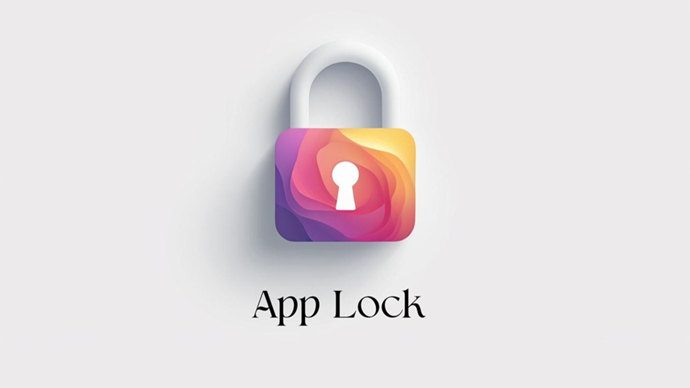

<div align="center">
  
</div>

  <h1 align="center">Lockify</h1>
<p align="center"><b>Secure App Lock by It Is Unique Official</b></p>

<p align="center">
  <a href="https://opensource.org/licenses/MIT">
    
  </a>
  <a href="https://github.com/itisuniqueofficial-gh/lockify">
    
  </a>
  <a href="https://lockify.itisuniqueofficial.com/">
    
  </a>
</p>

<p align="center">
  
  
  
</p>

<p align="center">
  
  
  
</p>
<p align="center">
  
</p>

---

## Overview

Lockify is an Android app locker maintained by It Is Unique Official.
It helps protect selected apps with PIN, pattern, and biometric authentication while keeping
the core experience lightweight and on-device.

<br/>

> [!CAUTION]
> Google Play Protect may warn during install or update because Lockify relies on overlay and accessibility-related permissions to secure apps. It may show a false pretext of "this app may try to access sensitive information"
> without any base or information. If this happens to you, consider disabling Play Protect temporarily as mentioned [here](https://www.airdroid.com/quick-guides/disable-google-play-protect).
>
> You may enable it back later after you install the app. We understand this introduces unnecessary friction but there's nothing we can do about it. Google does not like it
> when other developers try to fill the gaps they create themselves.

<br/>

> [!NOTE]
> Verify the app and source before installing any security-sensitive software.
>
> This repository contains the full Android source for Lockify.

<br/>

## Features

- Material You design, adapts to your theme
- Biometric and PIN authentication
- Fingerprint, Face Unlock, and PIN support
- Lock any app on your device
- Anti-uninstall protection
- Unlock timeout for convenience
- No root required
- One-tap app locking
- All data stays on your device
- Real-time background protection
- Lightweight and fast

<br/>

## Play Store

App name: `Lockify`

Package: `com.itisuniqueofficial.lockify`

Short description: `Secure your apps with smart protection - Lockify by It Is Unique Official.`

Website: https://lockify.itisuniqueofficial.com/

## Development

### Requirements

- Android Studio
- JDK 17+
- Android SDK configured locally

### Build

```bash
./gradlew assembleDebug
```

On Windows PowerShell:

```powershell
.\gradlew.bat assembleDebug
```

## Use Cases

- Shared devices
- Parental controls
- Protecting work apps
- General privacy

<br/>

## Maintainer

Maintained by It Is Unique Official

Website: https://lockify.itisuniqueofficial.com/
Portfolio: https://my.itisuniqueofficial.com
YouTube: https://www.youtube.com/@itisuniqueofficial_yt
Instagram: https://www.instagram.com/jayadtt_khodave
LinkedIn: https://in.linkedin.com/in/iamjaydatt

---

## License

Released under the MIT License. See `LICENSE`.
